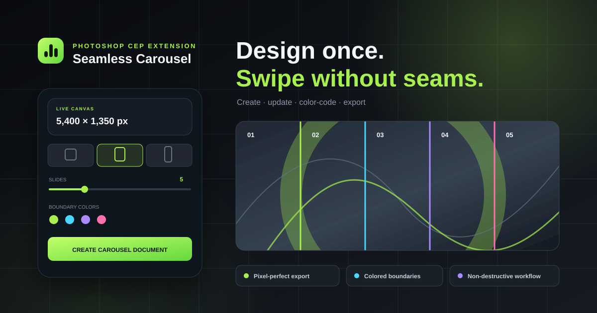

<div align="center">



# Seamless Carousel for Photoshop

**Design one continuous canvas. Export every Instagram slide perfectly.**

[](CSXS/manifest.xml)
[](https://www.adobe.com/products/photoshop.html)
[](#installation)
[](https://github.com/M-Noferesti/photoshop-seamless-carousel)

A modern Photoshop CEP extension for creating, updating, organizing, and exporting seamless Instagram carousels—without manually cropping every slide.

[Features](#features) · [Installation](#installation) · [Workflow](#workflow) · [Exporting](#exporting-slides) · [Shortcuts](#keyboard-shortcuts)

</div>

---

## Why use it?

Traditional carousel workflows make you choose between a seamless design and manageable individual slides. Seamless Carousel keeps one continuous Photoshop canvas, adds precise colored boundaries, and generates every final image automatically.

```text
 ONE CONTINUOUS DESIGN
 ┌────────────┬────────────┬────────────┬────────────┬────────────┐
 │  SLIDE 01  │  SLIDE 02  │  SLIDE 03  │  SLIDE 04  │  SLIDE 05  │
 │      artwork flows cleanly across every boundary →            │
 └────────────┴────────────┴────────────┴────────────┴────────────┘
                              ↓ EXPORT
      carousel_01.jpg  carousel_02.jpg  ...  carousel_05.jpg
```

## Features

| | Capability | What it does |
|---|---|---|
| 📐 | **Instagram presets** | Square `1:1`, portrait `4:5`, and story `9:16` formats |
| 🧩 | **2–20 slides** | Builds a single precisely sized panoramic canvas |
| 🎨 | **Colored guides** | Gives every slide boundary its own color plus a separate safe-area color |
| 🔄 | **Update current carousel** | Changes canvas dimensions, slide count, groups, margins, and guides without scaling artwork |
| 🗂️ | **Organized groups** | Creates named slide groups with hidden reference labels |
| 🛡️ | **Safe areas** | Adds adjustable per-slide margins to protect important content |
| ✂️ | **Separate export** | Produces one pixel-perfect PNG or JPEG for every slide |
| 💾 | **Non-destructive export** | Duplicates, crops, exports, and closes temporary documents automatically |
| ⚡ | **Persistent setup** | Remembers dimensions, colors, margins, quality, and other preferences |

## Installation

### Automatic installation on Windows

```powershell
git clone https://github.com/M-Noferesti/photoshop-seamless-carousel.git
cd photoshop-seamless-carousel
powershell -ExecutionPolicy Bypass -File .\install.ps1
```

Then restart Photoshop and open:

> **Window → Extensions (Legacy) → Seamless Carousel**

The installer copies the extension to your user CEP directory and enables CEP development mode. For a shared system installation, run PowerShell as Administrator:

```powershell
.\install.ps1 -SystemWide
```

<details>
<summary><strong>Manual installation</strong></summary>

Copy the repository folder into:

```text
%APPDATA%\Adobe\CEP\extensions\com.monstizo.seamlesscarousel
```

Unsigned CEP extensions require `PlayerDebugMode=1` in the appropriate `HKCU\Software\Adobe\CSXS.*` registry key. The included installer configures this automatically.

</details>

## Workflow


### 1. Create

Choose a preset or enter custom dimensions, select `2–20` slides, configure safe margins and guide colors, then click **Create carousel document**.

### 2. Design

Build the composition continuously across the vertical boundaries. Each divider can have a different color, making individual slides easy to identify without interrupting the artwork.

### 3. Update when needed

Change the setup and click **Update current carousel**. The extension resizes from the top-left, refreshes the colored guides, and creates missing slide groups. Existing artwork is not scaled and existing groups are not deleted.

### 4. Export

Click **Export slides separately**, select a destination folder, and receive numbered files ready for Instagram.

## Exporting slides

| Setting | Options |
|---|---|
| Format | PNG or JPEG |
| JPEG quality | 20–100 |
| Filename | Custom prefix |
| Output | `prefix_01.jpg`, `prefix_02.jpg`, … |

The source PSD remains untouched. Each slide is created from a temporary duplicate, cropped to the exact configured dimensions, exported, and closed without saving.

## Keyboard shortcuts

| Key | Action |
|:---:|---|
| `Enter` | Create a new carousel document |
| `U` | Update the active carousel setup |
| `G` | Add or replace guides |
| `E` | Export slides separately |
| `Esc` | Close the help window |

## Compatibility

- Adobe Photoshop with CEP/Extensions (Legacy) support
- Photoshop 23.4 or newer recommended for individual guide colors
- Older compatible Photoshop versions fall back to standard guide colors
- Windows installer included; the panel code itself is standard HTML/CSS/JavaScript + ExtendScript

## Project structure

```text
photoshop-seamless-carousel/
├── CSXS/manifest.xml      # CEP manifest
├── css/panel.css          # Panel interface
├── js/app.js              # UI behavior and CEP bridge
├── jsx/host.jsx           # Photoshop document operations
├── assets/                # README artwork
├── index.html             # Panel markup
└── install.ps1            # Windows installer
```

## Development

The extension has no package dependencies or build step. Edit the source files directly, reinstall the folder, and restart Photoshop to load changes.

```powershell
.\install.ps1
```

---

<div align="center">

Built for smooth swipes and cleaner Photoshop workflows.

**[Back to top](#seamless-carousel-for-photoshop)**

</div>
